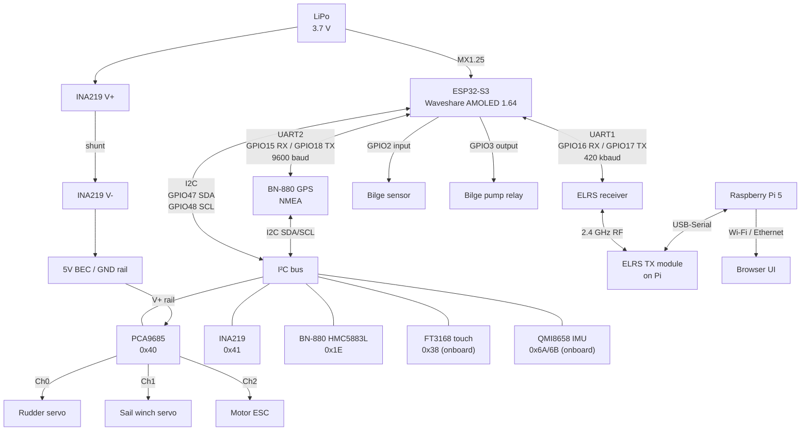

# Wiring reference

Complete connection guide for the RC sailboat bench assembly. Pin numbers are GPIO numbers on the Waveshare ESP32-S3-Touch-AMOLED-1.64 dev board. See `pinmap.md` for the rationale behind each assignment.

---

## I²C bus — GPIO47 (SDA) / GPIO48 (SCL)

One bus carries all I²C devices. Connect SDA and SCL in parallel across every device. A single pair of 4.7 kΩ pull-up resistors to 3.3 V is sufficient (the PCA9685 breakout typically includes them).

| Device | Module | I²C address | Location |
|---|---|---|---|
| FT3168 touch | Onboard | 0x38 | No wiring needed |
| QMI8658 IMU | Onboard | 0x6A or 0x6B | No wiring needed |
| PCA9685 servo driver | External breakout | **0x40** | P2 header pins |
| INA219 current sensor | External breakout | **0x41** | P2 header pins — A0 pad must be bridged first |
| HMC5883L compass | On BN-880 GPS module | **0x1E** | P2 header pins |

> **Address conflict:** INA219 ships with default address 0x40, same as PCA9685. Bridge the A0 solder jumper on the INA219 breakout to move it to 0x41 *before* wiring it up.

---

## UART1 — ELRS receiver, 420 000 baud, 8N1

| Signal | ESP32-S3 GPIO | ELRS receiver pin | Notes |
|---|---|---|---|
| MCU RX ← Rx TX | GPIO16 | TX | |
| MCU TX → Rx RX | GPIO17 | RX | Required for telemetry passthrough |
| GND | GND | GND | |
| Power | 3.3 V or 5 V | VCC | Check your receiver's datasheet |

Use a hardware UART (UART1 here). Do not bit-bang at 420 kbaud. UART0 (GPIO43/44) is the USB-Serial console — leave it alone.

---

## UART2 — GPS (BN-880), 9 600 baud, 8N1

| Signal | ESP32-S3 GPIO | BN-880 pin | Notes |
|---|---|---|---|
| MCU RX ← GPS TX | GPIO15 | TXD | NMEA sentences |
| MCU TX → GPS RX | GPIO18 | RXD | Optional; used for module config commands |
| GND | GND | GND | |
| Power | 3.3 V | VCC | |

The BN-880 also carries an HMC5883L compass chip. Wire the BN-880's SDA/SCL pads to the shared I²C bus (GPIO47/48) alongside the PCA9685 and INA219.

---

## SPI — SD card (onboard TF slot)

No external wiring. The TF card slot is soldered to the board.

| Signal | GPIO |
|---|---|
| CS | GPIO38 |
| MOSI | GPIO39 |
| MISO | GPIO40 |
| SCLK | GPIO41 |

---

## GPIO connections

| Function | GPIO | Direction | Notes |
|---|---|---|---|
| Bilge water sensor | GPIO2 | Input | Digital; add 10 kΩ pull-down if sensor is open-drain |
| Bilge pump relay | GPIO3 | Output | Drive a relay module or logic-level MOSFET gate |
| Battery ADC | GPIO4 | Analog in | Onboard voltage divider; no external wiring needed |

---

## PCA9685 servo channel assignments

| Channel | Load | Notes |
|---|---|---|
| 0 | Rudder servo | Standard RC servo, 50 Hz, 1–2 ms pulse |
| 1 | Sail winch servo | Standard RC servo |
| 2 | Motor ESC | ESC signal input; arm at neutral (1500 µs) on power-up |
| 3–15 | Unused | Leave disconnected |

The PCA9685 `/OE` pin: tie to GND for always-enabled, or wire to a free GPIO for firmware-controlled servo cutoff on failsafe.

---

## Power

| Rail | Source | Consumers |
|---|---|---|
| 3.7 V LiPo (3.0–4.2 V) | MX1.25 battery connector on ESP32 board | Board logic; charging via ETA6098 through USB-C |
| 3.3 V | ESP32 onboard regulator | GPS module, INA219 logic, PCA9685 logic, ELRS receiver (if 3.3 V type) |
| 5 V BEC (from ESC or standalone UBEC) | Main battery → ESC BEC output | PCA9685 V+ (servo power rail), ELRS receiver (if 5 V type) |
| Main battery (2S/3S LiPo) | Battery pack | Motor ESC, BEC input |

The INA219 shunt goes **in series with the main battery positive lead**: Battery+ → INA219 V+ → INA219 V− (shunt) → load.

> **Never** power the servo rail from the ESP32's VBUS/5V pin. Servo inrush current will brown out the microcontroller.

---

## System block diagram



---

## Prompt for a visual wiring diagram

Paste the following into Claude.ai (or any capable AI chat) to get a hand-drawn style visual diagram. You can also attach this file for full context.

---

```
I need a clear, easy-to-read visual wiring diagram for a remote-controlled sailboat electronics assembly.
Draw it in a breadboard/schematic style with labeled wires. Use distinct colors for:
  • Red = 3.3 V power
  • Orange = 5 V power
  • Black = GND
  • Blue = I²C (SDA/SCL)
  • Green = UART TX/RX
  • Yellow = PWM signal wires
  • Purple = analog

Main board: Waveshare ESP32-S3-Touch-AMOLED-1.64 dev board (label it clearly)

I²C bus — GPIO47 (SDA) and GPIO48 (SCL) — connect in parallel to:
  • PCA9685 servo driver breakout (I²C address 0x40); also needs 3.3 V VCC and GND
  • INA219 current sensor breakout (I²C address 0x41; A0 jumper bridged to shift from default 0x40)
  • BN-880 GPS module compass pads (HMC5883L, I²C address 0x1E)
  Add a 4.7 kΩ pull-up resistor on SDA and another on SCL, both to 3.3 V.

UART1 (420 kbaud): GPIO16 (MCU RX) ← ELRS receiver TX; GPIO17 (MCU TX) → ELRS receiver RX

UART2 (9600 baud): GPIO15 (MCU RX) ← BN-880 GPS TXD; GPIO18 (MCU TX) → BN-880 GPS RXD
  The BN-880 also has SDA/SCL pads — wire them to the I²C bus.

PCA9685 servo outputs (3-pin servo connectors: signal / 5V / GND):
  Channel 0 → Rudder servo
  Channel 1 → Sail winch servo
  Channel 2 → Motor ESC signal input
  PCA9685 V+ servo rail → 5 V BEC output
  PCA9685 /OE pin → GND (always enabled)

INA219 shunt placement:
  LiPo battery positive → INA219 V+ → INA219 V− (shunt) → load (ESC + BEC)
  INA219 VCC/GND → 3.3 V / GND

Power:
  LiPo 3.7 V → MX1.25 connector on ESP32 board (for MCU power)
  LiPo → Motor ESC → ESC BEC 5 V out → servo power rail + ELRS receiver VCC
  ESP32 3.3 V out → GPS VCC, INA219 VCC, PCA9685 VCC

GPIO connections:
  GPIO2 (input) → bilge water sensor (normally open float switch to GND; add 10 kΩ pull-down)
  GPIO3 (output) → relay module IN (coil driven by GPIO; relay NC/NO switches bilge pump)

Please make the diagram clean, component silhouettes clearly labeled, wire crossings minimized. Target audience: electronics hobbyist wiring this for the first time.
```
