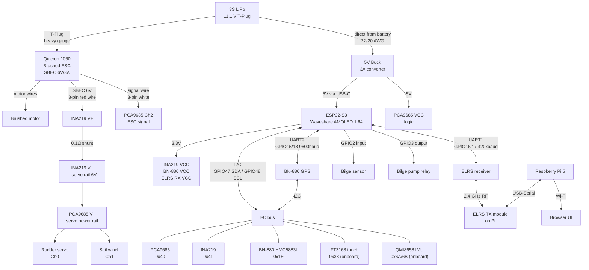

# Wiring reference

Complete connection guide for the RC sailboat bench assembly. Pin numbers are GPIO numbers on the Waveshare ESP32-S3-Touch-AMOLED-1.64 dev board. See `pinmap.md` for the rationale behind each assignment.

---

## Power architecture

The boat runs from a **3S LiPo** (11.1 V nominal, 9.0–12.6 V range, T-Plug connector). The Quicrun 1060 ESC has a built-in **SBEC (Switching BEC)** that outputs 6 V / 3 A — this powers all electronics except the motor.

```
  3S LiPo ──→ Quicrun 1060 ESC ──→ Motor
               │ SBEC out (6V / 3A)
               └──→ INA219 ──→ PCA9685 V+ (servo rail) ──→ Rudder servo
                                                        └──→ Sail winch servo

  3S LiPo ──→ 5V Buck converter ──→ ESP32 (USB-C), PCA9685 VCC
                                 └──→ INA219, BN-880, ELRS receiver (via ESP32 3.3V)
```

| Rail | Voltage | Source | Consumers |
|---|---|---|---|
| Motor | 9–12.6 V (direct battery) | Quicrun 1060 ESC | Brushed drive motor |
| Servo power | 6 V | ESC SBEC (via INA219 shunt) | PCA9685 V+ rail, all servo power pins |
| Logic 5 V | 5 V | 3A 5V buck converter (direct from 3S battery) | ESP32 board (via USB-C), PCA9685 VCC |
| Logic 3.3 V | 3.3 V | ESP32 onboard regulator | INA219, BN-880 GPS/compass, ELRS receiver |

### SBEC current budget (3A limit — keep total below this)

| Load | Typical draw | Peak draw |
|---|---|---|
| Rudder servo (standard RC) | 100–200 mA | ~500 mA |
| Sail winch servo | 200–500 mA | ~1.5–2 A |
| **Total** | **~300–700 mA** | **~2–2.5 A** |

Logic power (ESP32, PCA9685 VCC) is drawn directly from the battery via the buck converter and does not count against this budget. The SBEC has thermal protection and will reduce output rather than fail permanently, but a brownout will momentarily kill the servos.

> **If the boat will use a high-torque sail winch servo (e.g. HS-785HB or similar >1 A continuous), consider adding a separate UBEC to supplement the SBEC on the servo rail. See the [Optional UBEC supplement](#optional-ubec-supplement) section at the bottom.**

### Wire gauges

| Path | Recommended gauge | Reason |
|---|---|---|
| Battery → ESC (T-Plug) | 14–12 AWG silicone | Motor can draw 20+ A |
| ESC → motor | 14–12 AWG silicone | Same high current path |
| Battery → buck converter input | 22–20 AWG | <500 mA logic load |
| ESC SBEC out → INA219 → PCA9685 V+ | 20–18 AWG | Up to 2.5 A servo rail |
| Buck output → ESP32 USB-C | 22–20 AWG | <500 mA |
| Signal and I²C wires | 24–26 AWG | Low current only |

---

## ESC — HOBBYWING Quicrun 1060 Brushed (SBEC, T-Plug, 2–3S)

| Quicrun 1060 connection | Connects to | Notes |
|---|---|---|
| T-Plug power input | 3S LiPo T-Plug | Heavy-gauge silicone wire |
| Motor A (large red wire) | Motor terminal 1 | Swap A/B if motor spins the wrong way |
| Motor B (large black wire) | Motor terminal 2 | |
| 3-pin connector — signal (white/orange) | PCA9685 Ch2 signal pin | PWM signal from PCA9685 to ESC |
| 3-pin connector — +BEC (red) | PCA9685 V+ rail | **SBEC power output — leave this connected** |
| 3-pin connector — GND (black/brown) | GND rail | Common ground |

> The ESC's 3-pin servo connector is the output of the SBEC. Plugging it into the PCA9685 Ch2 header naturally feeds the SBEC's 6V output onto the PCA9685 V+ bus, which powers all servos. The signal wire goes from PCA9685 to the ESC; the power wire goes from ESC SBEC back to PCA9685.

---

## 5V Buck converter — 3A, 5V-30V in → 5V out

Powers the ESP32 and logic devices. Input is wired **directly to the 3S battery** (in parallel with the ESC), not to the SBEC output. The SBEC only outputs 6V, leaving just 1V of headroom; if it sags under servo load the buck converter loses regulation. Taking input from the battery (9–12.6V) gives 4–7.6V of headroom and ensures the logic rail stays stable regardless of what the servos are doing.

| Buck converter connection | Connects to | Notes |
|---|---|---|
| Input + | 3S LiPo + (in parallel with ESC input) | 9–12.6 V; plenty of headroom |
| Input − | GND rail | |
| Output + (5 V) | ESP32 USB-C VBUS | Use a USB-C power pigtail or cable |
| Output + (5 V) | PCA9685 VCC | Logic supply for the PCA9685 IC |
| Output − | GND rail | |

> **Powering the ESP32:** The Waveshare AMOLED board accepts 5 V via its USB-C port. Connect the buck converter's 5 V output to a short USB-C cable or pigtail (VBUS + GND only — no data lines needed). Do not connect a LiPo to the MX1.25 battery connector at the same time.

> **GPIO4 battery ADC note:** The onboard BAT_ADC divider on GPIO4 is calibrated for a 3.7 V LiPo cell. With 3S voltage (up to 12.6 V) the divider output would exceed the ESP32's 3.3 V ADC limit — **do not wire the 3S battery to GPIO4.** Battery voltage is monitored by the INA219 instead.

---

## INA219 current sensor — electronics rail only

The INA219's default 0.1 Ω shunt is rated for ~3.2 A. The motor draws 20–60 A through the ESC and must never be measured by the INA219. Wire the INA219 in series on the **SBEC output line** to monitor electronics + servo current, which stays within spec.

| INA219 connection | Connects to | Notes |
|---|---|---|
| VCC | ESP32 3.3 V | Logic supply |
| GND | GND | |
| SDA | GPIO47 | Shared I²C bus |
| SCL | GPIO48 | Shared I²C bus |
| V+ | SBEC output (6 V) | Before servo rail — high side of shunt |
| V− | PCA9685 V+ and all servo power | After shunt — current flows V+ → shunt → V− → loads |
| A0 pad | **Bridge to VS** | Shifts I²C address 0x40 → 0x41 (avoids clash with PCA9685) |

---

## I²C bus — GPIO47 (SDA) / GPIO48 (SCL)

One bus carries all I²C devices. Connect SDA and SCL in parallel across every device. A single pair of 4.7 kΩ pull-up resistors to 3.3 V is sufficient (the PCA9685 breakout typically includes them).

| Device | Module | I²C address | Power supply |
|---|---|---|---|
| FT3168 touch | Onboard | 0x38 | Onboard — no wiring needed |
| QMI8658 IMU | Onboard | 0x6A or 0x6B | Onboard — no wiring needed |
| PCA9685 servo driver | Teyleten Robot PCA9685 breakout | **0x40** | VCC: 5 V (from buck); V+: 6 V (from ESC SBEC) |
| INA219 current sensor | External breakout | **0x41** | VCC: 3.3 V — A0 pad must be bridged |
| HMC5883L compass | On BN-880 GPS module | **0x1E** | VCC: 3.3 V |

> **Address conflict:** INA219 ships with default address 0x40, same as PCA9685. Bridge the A0 solder jumper on the INA219 breakout before wiring.

---

## PCA9685 servo driver — Teyleten Robot 16-channel 12-bit PWM

The PCA9685 has two separate power inputs:

| PCA9685 pin | Connects to | Notes |
|---|---|---|
| VCC | 5 V (from buck converter) | Logic power for the IC — must be 2.3–5.5 V, do not connect 6V directly |
| GND | GND | |
| SDA | GPIO47 | I²C data |
| SCL | GPIO48 | I²C clock |
| V+ | SBEC output (after INA219 shunt) | Servo power rail — 6 V |
| GND (power rail) | GND | Must share GND with ESP32 |
| /OE | GND | Tie low for always-enabled outputs |

### Channel assignments

| Channel | Load | Notes |
|---|---|---|
| 0 | Rudder servo | Standard RC servo, 50 Hz, 1–2 ms pulse |
| 1 | Sail winch servo | Standard RC servo |
| 2 | Motor ESC signal | ESC signal input (white wire from Quicrun 1060 3-pin connector) |
| 3–15 | Unused | Leave disconnected |

---

## UART1 — ELRS receiver, 420 000 baud, 8N1

| Signal | ESP32-S3 GPIO | ELRS receiver pin | Notes |
|---|---|---|---|
| MCU RX ← Rx TX | GPIO16 | TX | |
| MCU TX → Rx RX | GPIO17 | RX | Required for telemetry passthrough |
| GND | GND | GND | |
| Power | 3.3 V (from ESP32) | VCC | Most modern ELRS receivers are 3.3 V tolerant — check datasheet |

---

## UART2 — GPS (BN-880), 9 600 baud, 8N1

| Signal | ESP32-S3 GPIO | BN-880 pin | Notes |
|---|---|---|---|
| MCU RX ← GPS TX | GPIO15 | TXD | NMEA sentences |
| MCU TX → GPS RX | GPIO18 | RXD | Optional; used for module config |
| GND | GND | GND | |
| Power | 3.3 V | VCC | |

The BN-880 also carries an HMC5883L compass chip. Wire the BN-880's SDA/SCL pads to the I²C bus (GPIO47/48) as well.

---

## SPI — SD card (onboard TF slot)

No external wiring. The TF card slot is soldered to the board.

| Signal | GPIO |
|---|---|
| CS | GPIO38 |
| MOSI | GPIO39 |
| MISO | GPIO40 |
| SCLK | GPIO41 |

---

## GPIO connections

| Function | GPIO | Direction | Notes |
|---|---|---|---|
| Bilge water sensor | GPIO2 | Input | Float switch to GND; internal pull-up enabled in firmware; dry = HIGH, wet = LOW |
| Bilge pump relay | GPIO3 | Output | Drive a relay module or logic-level MOSFET gate; pump draws from servo rail (6V) |
| Battery ADC | GPIO4 | — | **Not used** — calibrated for 3.7 V cell only; use INA219 for voltage monitoring |

---

## System block diagram



---

## Optional UBEC supplement

If a high-torque sail winch servo is fitted and the SBEC 3A limit feels too tight, a separate UBEC can be added **in parallel** on the servo power rail to supplement the SBEC. In that case:

1. Do **not** disconnect the ESC's red wire — the SBEC still powers the electronics via the buck converter.
2. Connect the UBEC output+ to the PCA9685 V+ rail alongside the SBEC.
3. Match the UBEC output voltage to the SBEC (both set to 6V) — mismatched voltages cause the higher-voltage source to back-feed the lower, which wastes power and can damage the lower-voltage BEC.
4. A Schottky diode (e.g. 1N5822, 3A) on each BEC's output+ before the shared rail prevents back-feeding if voltages drift slightly. Voltage drop across the diode (~0.3V) means the rail settles at ~5.7V, which is still fine for servos.

---

## Prompt for a visual wiring diagram

Paste the following into Claude.ai (or any capable AI chat) to get a hand-drawn style visual diagram. You can also attach this file for full context.

---

```
I need a clear, easy-to-read visual wiring diagram for a remote-controlled sailboat electronics assembly.
Draw it in a breadboard/schematic style with labeled wires and component silhouettes. Use distinct colors:
  • Dark red / thick = main battery (3S LiPo, high current)
  • Orange = 6 V servo rail (from ESC SBEC)
  • Yellow = 5 V logic rail (from buck converter)
  • Red thin = 3.3 V (from ESP32 regulator)
  • Black = GND
  • Blue = I²C (SDA/SCL)
  • Green = UART TX/RX
  • White/grey = PWM signal wires

Components:
  1. 3S LiPo battery, T-Plug connector (label: 11.1V)
  2. HOBBYWING Quicrun 1060 Brushed ESC (T-Plug input, two heavy motor output wires, 3-pin servo connector with signal/+BEC/GND)
  3. Brushed DC motor
  4. 3A 5V buck converter (input direct from 3S battery, output 5V)
  5. Waveshare ESP32-S3-Touch-AMOLED-1.64 dev board (USB-C port for 5V power input)
  6. Teyleten Robot PCA9685 16-channel PWM servo driver breakout (VCC pin for 5V logic, V+ pin for 6V servo power)
  7. INA219 current sensor breakout (A0 jumper bridged; in series on SBEC output line before PCA9685 V+)
  8. BN-880 GPS module (UART pins + separate I2C compass pads)
  9. ELRS receiver module
  10. Bilge float switch sensor
  11. Relay module for bilge pump

Power connections (use thick lines for high-current paths):
  Battery T-Plug → ESC T-Plug (thick dark red)
  ESC motor wires → motor (thick dark red)

  ESC 3-pin connector:
    +BEC (red wire) → INA219 V+ (orange, 6V)
    INA219 V− → PCA9685 V+ servo rail (orange, 6V)
    Signal (white wire) → PCA9685 Ch2 signal pin (grey/white, thin)
    GND (black) → GND rail

  PCA9685 V+ rail (6V) → rudder servo power pin, sail winch servo power pin

  Battery + → buck converter input+ (in parallel with ESC, 22-20 AWG)
  Buck converter output 5V → ESP32 USB-C VBUS (yellow, use USB-C pigtail)
  Buck converter output 5V → PCA9685 VCC pin
  Buck converter GND → GND rail

  ESP32 3.3V → INA219 VCC, BN-880 VCC, ELRS receiver VCC (thin red)

I2C bus (SDA=GPIO47, SCL=GPIO48 on ESP32):
  Connect in parallel to: PCA9685 (0x40), INA219 (0x41, A0 bridged), BN-880 compass (0x1E)
  Add 4.7kΩ pull-ups: SDA → 3.3V, SCL → 3.3V

UART1 (GPIO16 RX, GPIO17 TX) → ELRS receiver TX, RX
UART2 (GPIO15 RX, GPIO18 TX) → BN-880 GPS TXD, RXD
BN-880 SDA/SCL compass pads → I2C bus

PCA9685 channel signal wires (50Hz PWM):
  Ch0 → rudder servo signal
  Ch1 → sail winch servo signal
  Ch2 → ESC white signal wire (already connected via ESC 3-pin)

GPIO:
  GPIO2 (input, pull-up) → float switch → GND
  GPIO3 (output) → relay IN → relay switches bilge pump from 6V servo rail

Important callouts:
  ⚠ ESC SBEC (6V/3A) powers servos only — buck converter draws from battery directly, not from SBEC
  ⚠ INA219 shunt measures electronics/servo current ONLY — motor current is NOT measured
  ⚠ PCA9685 VCC must be 5V from buck — do NOT connect 6V SBEC directly to VCC pin (max 5.5V)
  ⚠ Do NOT connect 3S battery to ESP32 MX1.25 LiPo port (BAT_ADC calibrated for 3.7V only)

Target audience: electronics hobbyist wiring this for the first time. Make high-current wires visually thicker than signal wires.
```
